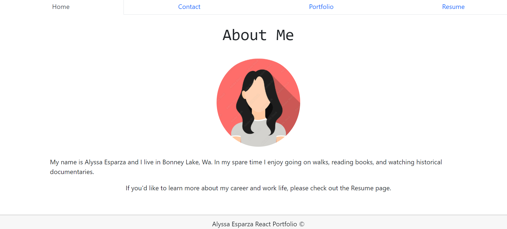

# React portfolio 

### Table of Contents
- [Description](#description)
- [Technology Used](#technology-used)
- [Screenshots](#screenshots)
- [Installation](intallation)
- [GitHub Link](#github-link)

### Description 
This is a very minimalist react portfolio. That have a main page, resume portfolio, and a contact page where an employer or anyone can reach out and contact me directly.

### Technology Used
* `create react-app`
* `bootstrap-react`
* `bootstrap`
* `webpack-react`
* `react`
 
### Installation
* To start application us `npm run start`
* To build your application run `npm run build`

#### Screenshots

#### GitHub Link: 
[Github](https://github.com/alyesp/react-portfolio2)